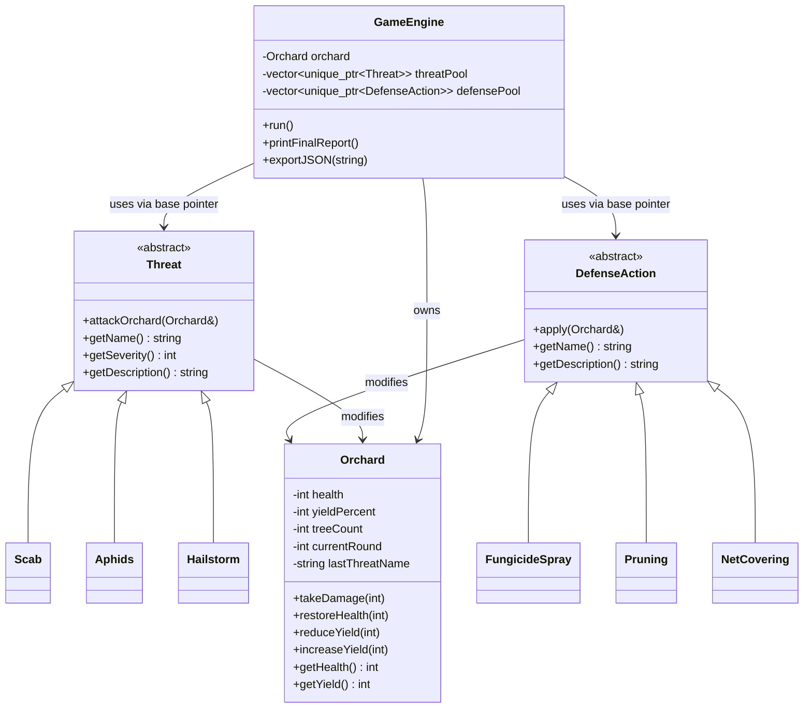

# Architecture

## Overview

AgroSentinel has two clearly separated parts:

```
┌─────────────────────────────┐        writes         ┌──────────────────────────┐
│   C++ SIMULATION ENGINE      │ ─────────────────────▶│  visualization/data/     │
│   (the real OOP project)     │   simulation_log.json  │  simulation_log.json     │
│   src/ + include/            │                        └──────────────────────────┘
└─────────────────────────────┘                                    │
                                                                    │ reads (fetch)
                                                                    ▼
                                                     ┌──────────────────────────┐
                                                     │  visualization/           │
                                                     │  index.html + script.js  │
                                                     │  (HTML/CSS/JS dashboard) │
                                                     └──────────────────────────┘
```

The C++ program is the **only** place where simulation logic lives. It
runs entirely on its own in a terminal — the visualization is optional
"eye candy" layered on top afterwards. This separation means the
professor can evaluate 100% of the OOP design just by reading
`include/` and `src/`, without ever opening a browser.

## How the two halves communicate

There is no network connection, no API, and no live communication of
any kind (deliberately — this keeps the beginner-friendly reasoning
about "wires" as simple as possible):

1. You run the compiled C++ program (`./agrosentinel` or similar).
2. It simulates several rounds, printing everything to the console.
3. At the end, `GameEngine::exportJSON()` writes a single file:
   `visualization/data/simulation_log.json`.
4. You open `visualization/index.html` (through a tiny local web
   server — see the README for the exact command) and `script.js`
   fetches that JSON file and draws the dashboard from it.

This is **Option B** from the project brief: *"C++ executable producing
structured output/data + HTML/CSS/JavaScript visualization."* It was
chosen over a full C++ web backend because it requires no networking
library, no server framework, and no extra beginner concepts (sockets,
HTTP routing, JSON parsing in C++) — just simple, standard file I/O
(`std::ofstream`), which fits naturally with what a first C++/OOP course
already teaches.

## Module breakdown

| Folder            | Responsibility                                            |
|-------------------|------------------------------------------------------------|
| `include/`        | Class declarations (the public "contract" of each class). |
| `src/`            | Class implementations + `main.cpp` entry point.            |
| `tests/`          | Small, dependency-free test suite.                         |
| `visualization/`  | Static HTML/CSS/JS dashboard, reads the JSON export.       |
| `docs/`           | This documentation set.                                     |
| `examples/`       | A saved sample run of the console program.                  |

## Class relationships

```
Threat (abstract)              DefenseAction (abstract)
   ├── Scab                        ├── FungicideSpray
   ├── Aphids                      ├── Pruning
   └── Hailstorm                   └── NetCovering

Orchard  ←── (used by) ──  Threat subclasses, DefenseAction subclasses
Orchard, Threat, DefenseAction  ←── (owned/used by) ──  GameEngine
GameEngine  ←── (used by) ──  main()
```

`GameEngine` is a *composition root*: it owns one `Orchard`, a pool of
`std::unique_ptr<Threat>`, and a pool of `std::unique_ptr<DefenseAction>`.
It is the only class that knows about every other class; every other
class only knows about `Orchard` (threats and defenses modify the
orchard) and, in the case of derived classes, their own base class.

## Mermaid class diagram


